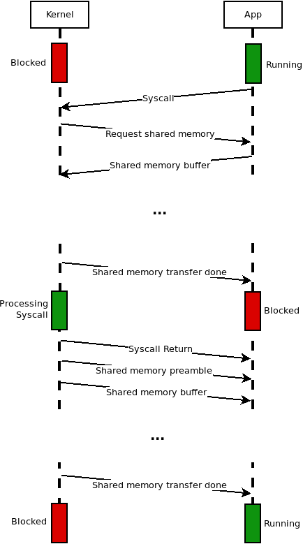

Host-Side Testing Framework
===========================

The Tock Host-Side Testing Framework is an extension to the Tock kernel and
libtock-rs that enables testing of Tock applications on Linux machines as native
applications.

Running Tock apps either requires emulation or physical hardware. The first can
be prohibitively slow, and the latter can be difficult to source and debug. This
framework serves as a third option, solving these problems at the cost of some
additional abstractions. These abstractions may make this framework unsuitable
at identifying certain architecture dependent bugs, including those relating to
timing, memory protection, and context switching.

The portion of this framework that adds support for platform specific drivers
and capsules is still in the works. Currently HILs must be implemented on host
to be supported under this framework.

<!-- npm i -g markdown-toc; markdown-toc -i HostSideTesting.md -->

### Userspace Kernel Boundary

The userspace kernel boundary consists of the syscall interface, syscall return
interface, and shared memory synchronization. All of these are done over Unix
Domain Sockets. To maintain the same soundness guarantees that Tock offers, it
is only possible for the kernel or a single process to be executing at a given
time. This means that the only time that the kernel and process need to
synchronized any shared state is during syscalls and syscall returns/callbacks.

The process of a syscall is as follows:

The semantics of syscalls are the same as documented in the [Syscall
Documentation](Syscalls.md), and with the exception of `ALLOW` all are passed to
the core kernel without any special handling.

#### Allow Syscall

This framework does not support sharing memory between the kernel process and
app processes. Instead, all regions that have been shared via the `ALLOW`
syscall are transferred over the same communication channel that is used for
syscalls. These addresses are translated on the kernel side and mapped into
buffers of equivalent size and alignment in kernel heap space. This tradeoff
offers simplicity and robustness at the cost of performance. All shared buffers
belonging to an application are copied twice for each syscall.

#### Syscall Returns

The kernel can resume execution of a process in one of three ways:

1. Returning from a syscall
2. Issuing a callback
3. Executing the process for the first time

Normally Tock doesn't distinguish between 2 and 3, executing a process by
issuing a callback to `_start`. On host there is a distinction, which is handled
by the framework by treating a callback to address `0` as a request to issue an
`exec()` to the process.

### Applications

To test applications on host they must be complied as Linux ELF binaries using a
version of [libtock-rs](https://github.com/tock/libtock-rs) that implements the
userland side of the userspace kernel boundary.

Applications are not loaded from TBF headers, but are side loaded from
executable paths that are passed to the kernel process as command line
arguments.

